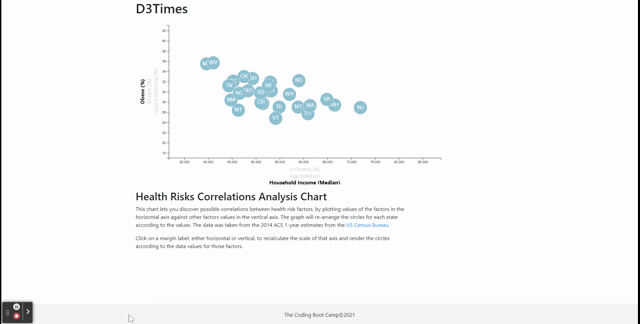

# D3 Homework - Data Journalism and D3


## Background

Welcome to the newsroom! You've just accepted a data visualization position for a major metro paper. You're tasked with analyzing the current trends shaping people's lives, as well as creating charts, graphs, and interactive elements to help readers understand your findings.

The editor wants to run a series of feature stories about the health risks facing particular demographics. She's counting on you to sniff out the first story idea by sifting through information from the U.S. Census Bureau and the Behavioral Risk Factor Surveillance System.

The data set included with the assignment is based on 2014 ACS 1-year estimates from the [US Census Bureau](https://data.census.gov/cedsci/), but you are free to investigate a different data set. The current data set includes data on rates of income, obesity, poverty, etc. by state. MOE stands for "margin of error."


### Core Assignment: D3 Dabbler (Required Assignment)


This part of the homework creates a scatter plot between two of the data variables, "Obesity vs. Income Level (Median)".

Using the D3 techniques learned in class, we created a scatter plot that represents each state with circle elements. Data is pulled from a local file `data.csv` by using the `d3.csv` function. 

- - -

### Bonus: Impress the Boss (Optional Assignment)

Why make a static graphic when D3 lets you interact with your data?



#### 1. More Data, More Dynamics

This chart includes more demographics and more risk factors. Labels  are placed in the scatter plot given click events so that users can decide which data to display. The transitions of the circles' locations is animated, as well as the ranges for the axes. 

#### 2. d3-tip Tooltips

While the ticks on the axes allow us to infer approximate values for each circle, it's impossible to determine the true value without adding another layer of data. Enter tooltips: developers can implement these in their D3 graphics to reveal a specific element's data when the user hovers their cursor over the element. We have added tooltips to the circles, and display each one when the user hovers over the circle. 


### Notes:
There are two sets of files for each of the homework assignments:

`index.html` - Landing page, contains links to other pages. 

`index1.html` - Contains the HTML page for the Core assignment (Static Scatter plot).

`apps.js`    - Contains the Javascript logic for the Core assignment.

`index2.html` - Contains the HTML for the dynamic part (Optional Assignment).

`apps2.js` - Contains the Javascript logic for the dynamic part. 


### How to run it

1) Clone the [repository]( ) to your local machine.
2) Activate the http background process that will serve the application.  You can use LiveServer or a Python HTTP server if installed:

LiveServer

* Open the project directory with VS code.

* Right click on file ```index.html```, and select "Open With Live Server".  The landing page will be displayed in your default web browser at URL address = http://localhost:5000/index.html.


	
Python http Server

* From VS Code, right click on file ```runServer.sh``` and select "Open In Integrated Terminal".
*  Activate your Python environment in the terminal window that opens, if it is not automatically activated.
*  type ```./runServer.sh```,  This will activate the HTTP server and the home page will be available in http://localhost:8000/index.html by default (The port name can change, depending on other programs using port 8000).
	
	
- - -
### Copyright

© 2021 Trilogy Education Services, LLC, a 2U, Inc. brand. Confidential and Proprietary. All Rights Reserved.
